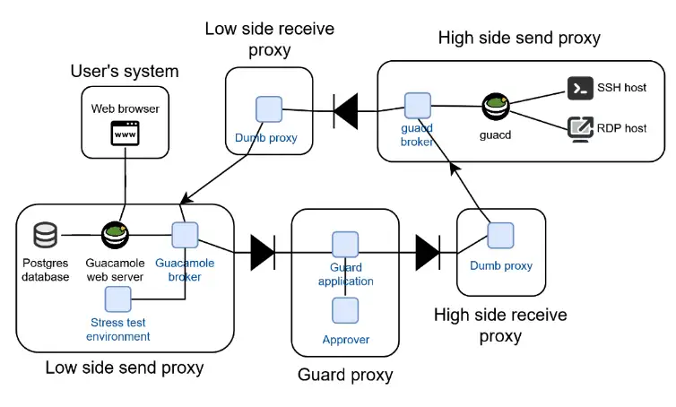
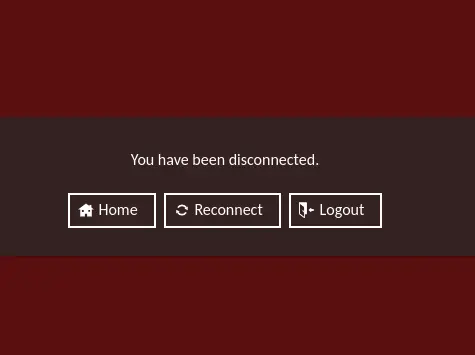
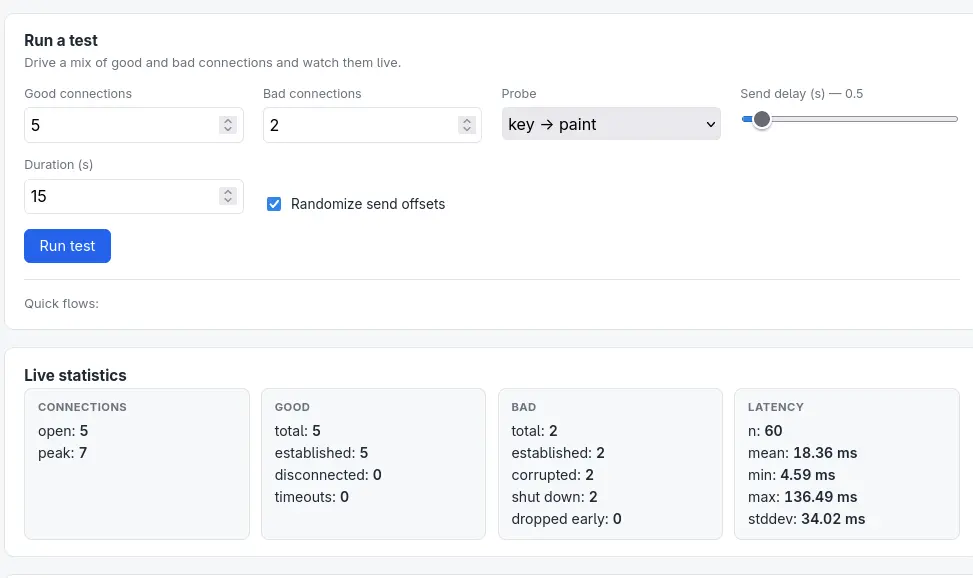

Iron Bridge: foundation of the 'remote access over a Triple Data Diode architecture' use case.

Project Iron Bridge created the initial PoC for a secure system that regulates the flow of Guacamole remote access traffic between networks. It was created to give control and security over data streams to the OT (DCS) side. This increases plant operator control over inbound requests. It provides strict filtering on inbound traffic.


## Architecture

In total, five C++ CLI programs ('apps') were developed to make the use case possible (excluding Guacamole and remote access apps). Three of these are necessary to run:
- **gmlbroker**, Guacamole broker. The interface through which the web server receives and sends remote access traffic. It sits on the non-critical side of the network (plant DMZ) and routes remote access traffic over the Triple Data Diode (3DD). Runs on: low side send proxy.
- **guard**. This application filters out any traffic not strictly required for remote access. This includes file transfer operations. It also serves as the approving/denying barrier for remote connections. Runs on: guard proxy.
- **gcdbroker**, guacd broker. The interface through which the guacd program receives and sends remote access traffic. Runs on: high side send proxy.

On the hardware topology level, there are two network paths, one inbound (into the plant) and one outbound. It is physically impossible to reverse the network stream direction on these paths, due to data diodes. Simplified, the paths visit:

Inbound: web server <--> Guacamole broker -->(DD) guard -->(DD) guacd broker <--> guacd

and

Outbound: guacd <--> guacd broker -->(DD) Guacamole broker <--> web server

where DD is one data diode.

Two receiver proxies were created (low side receive proxy & high side receive proxy) to route traffic from guacd broker and from the guard respectively. We currently do not see much use in these proxies, as their presence does not contribute to security much, and can be left out.

The full architecture:



## Environment

Each app runs inside its own Docker container. Some Docker Compose configurations were made for convenient testing and running the system. Currently, the following configurations exist inside 3dd/docker:
- 1node: Run all applications on a single machine (including the optional proxies)
- 3node: Run necessary applications on three nodes: the low node (web server + broker), the guard node (guard proxy), and the high node (guacd + broker). Needs additional network (IP address + ARP entry) configuration to work
- 5node: Same as 3node, but also runs the optional proxies on two different nodes. Also needs additional network configuration to work.
- bridgeless: a pure web server-to-guacd configuration with no 3DD apps involved.

## Installation

git clone the repository. For a 3 node configuration, connect up each nodeas shown in the architecture diagram with ethernet cables. Then, configure each node to have its own IP address. For nodes that SEND over a data diode, the address which they are sending to needs to be hardcoded. Normally, it can discover addresses using ARP, but a pure data diode does not allow this to happen.

### Network configuration

There are two ways to do network configuration: manually or automated. Manual setup on all three nodes requires:
```
# IP addresses
sudo ip addr add <send-ip> dev <send-interface>
sudo ip link set <send-interface> up
sudo ip addr add <receive-ip> <receive-interface>
sudo ip link set <receive-interface> up

# Set ARP entry for sending interface
sudo ip neigh add <ip-to-send-to> lladdr <mac-address-to-send-to> nud permanent dev <send-interface>
```

However, there is a setup script that wipes IP addresses and ARP entries on an interface and sets new ones automatically (3dd/setup/setup.py). It uses a YAML config for the placeholder values. See 3dd/setup/3node-routing-example.yml for an example. The setup script will automatically apply the values with:
```
sudo python3 setup.py config.yml
```

### Docker configuration

When configs for all three nodes are created and applied, go to the docker configurations and run the desired configuration. For example, for a 3node configuration:
```
# low side machine
docker compose -f lownode.compose.yml up --build

# guard machine
docker compose -f guardnode.compose.yml up --build

# high side machine
docker compose -f highnode.compose.yml up --build
```

For 1node configurations it is not required to pass the `-f compose.yml` argument if the current working directory is already 3dd/docker/1node.

Tip: Hardcoded ARP entries may be removed by the kernel on startup/network reload, so it is recommended to run the setup script right before the docker command each time it runs.

## Usage

Navigate to [http://localhost:8080] which is where the web server listens. Use username `guacadmin` and password `guacadmin` to access the dashboard. This is where all created connections are visible.

### Create a connection

Create a connection by clicking on the top-right username button, and clicking Settings. Go to Connections, and click on New Connection.

Both RDP and SSH remote access is possible due to the `sshd` and `rdp` containers that run on the configurations. For example, to connect to the `rdp` container, use the following connection parameters:
- Protocol: RDP
- Hostname (section PARAMETERS): rdp
- Port: 3389
- Username: tester1
- Password: testpass
- Ignore server certificate: checked

(Both `sshd` and `rdp` have accounts `tester1`, `tester2`, and `tester3`, all with password `testpass`.)

An SSH on Docker connection could use:
- Protocol: SSH
- Hostname (section PARAMETERS): sshd
- Port: 22
- Username: tester1
- Password: testpass

Click Save, go back to the dashboard, and click the connection.

### Approve connections

The screen should turn red and the user is disconnected:



This shows one of Iron Bridge's strong security measures: by default, no user can connect to, or even reach guacd. The request is stopped by the guard, which denies all connections by default. That means that no traffic will ever reach guacd before an approval is given. This approval is given by the plant operator that controls the guard.

To let all connections through, navigate to the Approver dashboard on [http://localhost:8082] on the guard machine. Click on Approve, and try to reconnect. After a while, a desktop should be visible. Access was granted. (Also, the guard can disconnect any active session with the deny button, too)

### File blocking

By default, file transfers using Guacamole are allowed. However, the guard should catch any attempt at transferring files and block the operation. Dragging and dropping a file from the Guacamole client on the browser canvas should not go through, and the guard logs the unpermitted operation to stdout.

### Clipboard blocking

Clipboard transfers can be blocked in the same way as files are. For the demo of Iron Bridge, an exception was created where only payloads smaller than fifty characters were let through. However, it must be stressed that letting through any amount of clipboard data can seriously damage the 3DD's security principles. This feature will likely be replaced by an unconditional clipboard blocking feature.

## Testing

Iron Bridge tested the code using the following methods:
- Unit testing (partial coverage);
- Stress testing (checking potential network capacity of the 3DD);
- Static code analysis (CodeQL);
- User Acceptance Test.

### Unit testing

Unit tests are run by default when a configuration runs. Not all code is fully covered. For example, currently, the guard's only tested unit is the parser logic.

To disable testing on configuration run, add the following to a configuration's compose file (watch the quotation marks surrounding "true"):
```
  gmlbroker:
    build:
      args:
        DISABLE_TESTS: "true"
```

### Stress testing

As part of Iron Bridge, a standalone stress testing environment was built in Python. Although it is not the most representative simulation method for testing real-world use, it can put high stress on the 3DD and measure network statistics.



Test the amount of connections that can be active at once by setting good connections. Set bad connections to 0, and play around with some other parameters. Hovering over a parameter shows its description. When running a test, pay special attention to the timeouts field. During the test, the active connections attempt to simultaneously send key strokes and wait for a screen update back from the remote host. Any time such a reply is not received before a timeout happens (2 seconds), the timeout field increases by one. Divided by the n statistic (amount of key strokes sent), a rough metric of loss can be interpreted.

The Bad connections parameter simulates non-Guacamole traffic (reverse shell, HTTP call, etc.) to guacd. The guard should catch this bad traffic in flight and shut down the connections. This partially tests the traffic filtering feature on the guard.

### Static code analysis

The C++ components are scanned with [CodeQL](https://codeql.github.com/). Two helper scripts in `3dd/scripts/` drive this:

- `codeql-build-cpp.sh` does a clean (full recompile) build of every component, which CodeQL traces by observing the real compiler invocations.
- `codeql-scan.sh` creates the database, runs the analysis suite, and writes the results.

Prerequisites: the CodeQL CLI on your `PATH` (or point the `CODEQL` env var at the binary; it also falls back to `$HOME/tools/codeql/codeql`), plus the usual `meson`/`ninja`/`g++` toolchain.

Installing the CodeQL CLI (the `$HOME/tools/codeql` fallback location):
```
# Pick the latest release for your platform from
# https://github.com/github/codeql-action/releases (the codeql-bundle assets
# ship the CLI together with the standard query packs).
mkdir -p "$HOME/tools"
cd "$HOME/tools"
curl -L -o codeql-bundle.tar.gz \
    https://github.com/github/codeql-action/releases/latest/download/codeql-bundle-linux64.tar.gz
tar -xzf codeql-bundle.tar.gz   # extracts a ./codeql directory
rm codeql-bundle.tar.gz

# Verify (the scripts find it here, or add it to your PATH):
"$HOME/tools/codeql/codeql" --version
export PATH="$HOME/tools/codeql:$PATH"
```
On macOS use the `codeql-bundle-osx64.tar.gz` asset instead. Alternatively install via Homebrew (`brew install codeql`).

Run the scan from the `3dd/` directory:
```
scripts/codeql-scan.sh
```

By default it runs the `cpp-security-and-quality` suite. Pick a different suite with the `SUITE` env var, for example:
```
SUITE=cpp-security-extended scripts/codeql-scan.sh
```

Outputs are written to `3dd/.codeql/` (gitignored):
- `cpp-db/` — the CodeQL database;
- `cpp-results.sarif` — the full result set (open in an editor's SARIF viewer);
- `cpp-results.csv` — a human-readable summary, one row per alert.

## Issues

- Make sure the IP addresses and neighbor table (ARP) are set correctly before running, or the routing will not work.
- If you are having trouble with running many RDP connections at once, set the following settings to reduce traffic bandwidth: 
    - Color depth 8 or 16-bit (not 24/32)
    - Disable wallpaper, theming, font smoothing, full-window drag, menu animations, and desktop composition
    - A smaller resolution if possible
