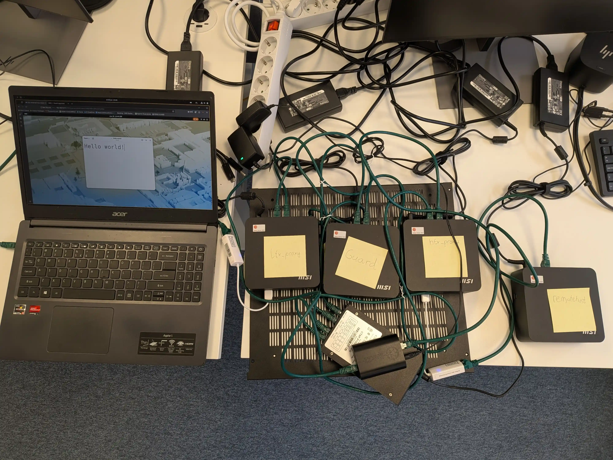
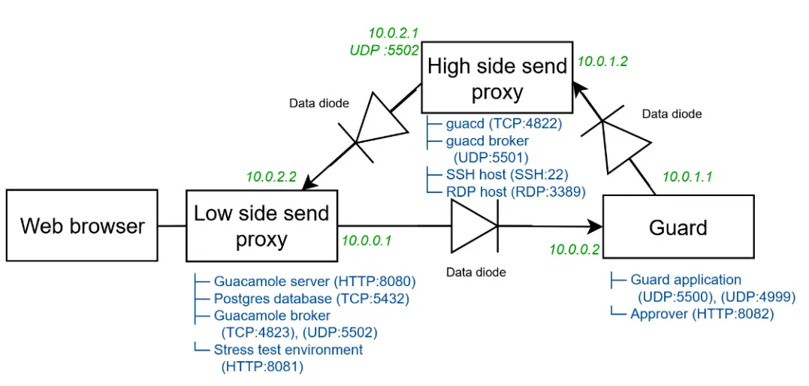

This documentation file shows three ways to install and run the apps for Guacamole remote access:
1. Running all applications on a single node (= machine);
2. Running the applications on three nodes (low, guard, and high);
3. Running the applications on three nodes, with automatic login and container launch on startup.

In all three cases, to start, clone the git repository locally.

> Note: Make sure that any currently running 3DD configurations are shut down with `docker compose -f ... down`. And make sure that no programs are running on network port 8080, on the machine that runs the Guacamole web browser.

## Single node run

1. Open a terminal, `cd` to `3dd` and run the command:
```
docker compose -f docker/1node/compose.yml up --build
```

This builds and runs the single-node configuration, and shows the logs in the terminal.

> If you do not want to see the logs, press `d`, or run the commmand with the `-d` flag.

2. Navigate to the Guacamole dashboard by entering http://localhost:8080/guacamole in your web browser. Log in with username `guacadmin` and password `guacadmin`. On first run, this presents an empty dashboard.

3. The single-node configuration allows users to remotely access `rdp` or `sshd` containers. Create an RDP connection by going to the top-right username button, clicking settings, go to tab Connections, and click on New Connection. Use the following parameters:
- Name: rdp-docker-tester1 (or anything of your liking)
- Protocol: RDP
- Hostname (section PARAMETERS): rdp
- Port (section PARAMETERS): 3389
- Username: tester1
- Password: testpass
- Security mode: empty
- Ignore server certificate: checked

4. Click Save.

Optionally, try to connect from the dashboard now. The guard should block this login attempt with a red screen, as it has not given out an approval yet:


By default, the guard denies requests. In the PoC, a solid approval system was not yet implemented, so a temporary one has taken its place.

5. Navigate to http://localhost:8082 on the node and click the Approve button. This will approve all future connections. Now try to connect again, and a desktop screen should show up on the browser window. This is remote access! You can create and use multiple connections simultaneously in different browser windows.

Optionally, to force close all open connections, press the Deny button on the guard approval interface.

### File blocking

By default, file transfers using Guacamole are allowed. However, the guard should catch any attempt at transferring files and block the operation. Dragging and dropping a file from the Guacamole client on the browser canvas should not go through, and the guard logs the unpermitted operation to stdout.

### Clipboard blocking

Clipboard transfers can be blocked in the same way as files are. For the demo of Iron Bridge, an exception was created where only payloads smaller than fifty characters were let through. However, it must be stressed that letting through any amount of clipboard data can seriously damage the 3DD's security principles. This feature will likely be replaced by an unconditional clipboard blocking feature.

## Three-node run

This configuration shows how to get three-node remote access working, where each node communicates to another node via a data diode. The setup is shown in the image below. A laptop connected to the web server controls a remote host (on the white surface). The nodes on the black rack are part of the Triple Data Diode (low node, guard, and high node). They are connected through three data diodes (one Garland CTAP that functions as two data diodes and one link22 Data Diode Zero).



First, the IP addresses of each node's ingoing and outgoing connection must be statically configured. The image below shows the listener ports of all involved apps and sample IP addresses. It is recommended to use these IP addresses for your own configuration.



1. Open a terminal and `cd` to `3dd`.

2. Create a file that holds the network configuration. You can simply copy the example configuration from `3dd/setup`, which already contains these IP addresses. Any location will work, this guide uses `.env`.
```
mkdir .env && \
cp setup/3node-routing-example.yml .env/3node-routing.yml
```

3. Set the interface names and MAC addresses in the file to the values on the machines and their interfaces. Run `ip addr show` to list available interfaces, and pick the interfaces for ingoing and outgoing communication. This also shows their associated MAC address you need to fill in. Copy the finished config file to each node, setting the correct `current-node` and `next-node` values (e.g. on the guard node these values are `guard` and `highnode` respectively).

Why do we want (only) MAC addresses of receiving interfaces? Because the sending machine cannot 'discover' IP addresses of machines that are behind a true data diode.

4. Once set, running a setup script will apply the configuration with:
```
sudo python3 setup/setup.py .env/3node-routing.yml
```

> Warning: this script will wipe all existing IP addresses and neighbor entries for the selected network interfaces. If this is unwanted, manually configure the neighbor and IP addresses.

5. Run the 3-node configuration on all three nodes, one of the following commands:
```
docker compose -f docker/3node/lownode.compose.yml --build
docker compose -f docker/3node/guardnode.compose.yml --build
docker compose -f docker/3node/highnode.compose.yml --build
```

This builds and runs the configuration, and shows the logs in the terminal.

> If you do not want to see the logs, press `d`, or run the commmand with the `-d` flag.

6. Navigate to the Guacamole dashboard by entering http://localhost:8080/guacamole in your web browser. Log in with username `guacadmin` and password `guacadmin`. On first run, this presents an empty dashboard.

7. Create an RDP connection by going to the top-right username button, clicking settings, go to tab Connections, and click on New Connection. Use the following parameters:
- Name: rdp-terminal-server (or anything of your liking)
- Protocol: RDP
- Hostname (section PARAMETERS): rdp
- Port (section PARAMETERS): 3389
- Username: <terminal server username>
- Password: <terminal server password>
- Security mode: NLA (or select Any/leave empty if the terminal server does not support NLA)
- Ignore server certificate: checked

8. Click Save. Then navigate to http://localhost:8082 on the guard node and click the Approve button. This will approve all future connections. Now try to connect, and a desktop screen should show up on the browser window. This is remote access! You can create and use multiple connections simultaneously in different browser windows.

## Autonomous three-node run

This guide contains some extra steps to make the previous three-node run directly when the system powers on (login and sudo bypass, autostart script). The guide uses GNOME Display manager, and differs from other display managers.

1. Configure your Linux OS to bypass logins of an account. The setup we use uses GDM, requiring the following to be added to `/etc/gdm/custom.conf`:
```
[daemon]
AutomaticLoginEnable=True
AutomaticLogin=<account-name>
```

2. Create an autostart script and desktop entry for each device in `~/.config/autostart` (create it if it does not exist). As an example, this is what the low node files look like:

`3dd-lownode-startup.desktop`:
```
[Desktop Entry]
Type=Application
Name=3DD Low Node startup
Exec=sudo /home/<account-name>/.config/autostart/lownode-startup.sh
Icon=dialog-information
Terminal=true
X-GNOME-Autostart-enabled=true
```


`lownode-startup.sh`:
```
sudo python3 /home/<account-name>/dev/guacamole-datadiode/3dd/setup/setup.py <location-of-network-config-file> && \
docker compose -f /home/<account-name>/dev/guacamole-datadiode/3dd/docker/3node/lownode.compose.yml up --build

read -p "Press [Enter] to close the terminal..."

```

This starts up a terminal with the network setup script having configured the networking and the Docker logs visible on startup.

3. Make the shell scripts executable.
```
chmod +x ~/.config/autostart/lownode-startup.sh
```

4. Make the script run without requiring a password by editing/creating a file in `sudoers.d`:
```
sudo visudo /etc/sudoers.d/99-lownode-startup
```

And entering:
```
<account-name> ALL=(ALL) NOPASSWD: /home/<account-name>/.config/autostart/lownode-startup.sh
```

Now reboot and a Docker terminal should automatically run on startup.

> Note: Some network managers (like `nmcli`) may flush some ARP entries configured by the setup script at any time. If you encounter routing errors, check the neighbor table with `ip neigh show`. When using `nmcli`, you can make it 'unmanage' certain network interfaces, making sure the manager will never flush those ARP entries again. In the case of `nmcli`, create a new file, e.g. `99-datadiode-unmanaged.conf` inside `/etc/NetworkManager/conf.d` with the contents:
> ```
> [keyfile]
> unmanaged-devices=interface-name:<inbound-interface-name>;interface-name:<outbound-interface-name>
> ```

