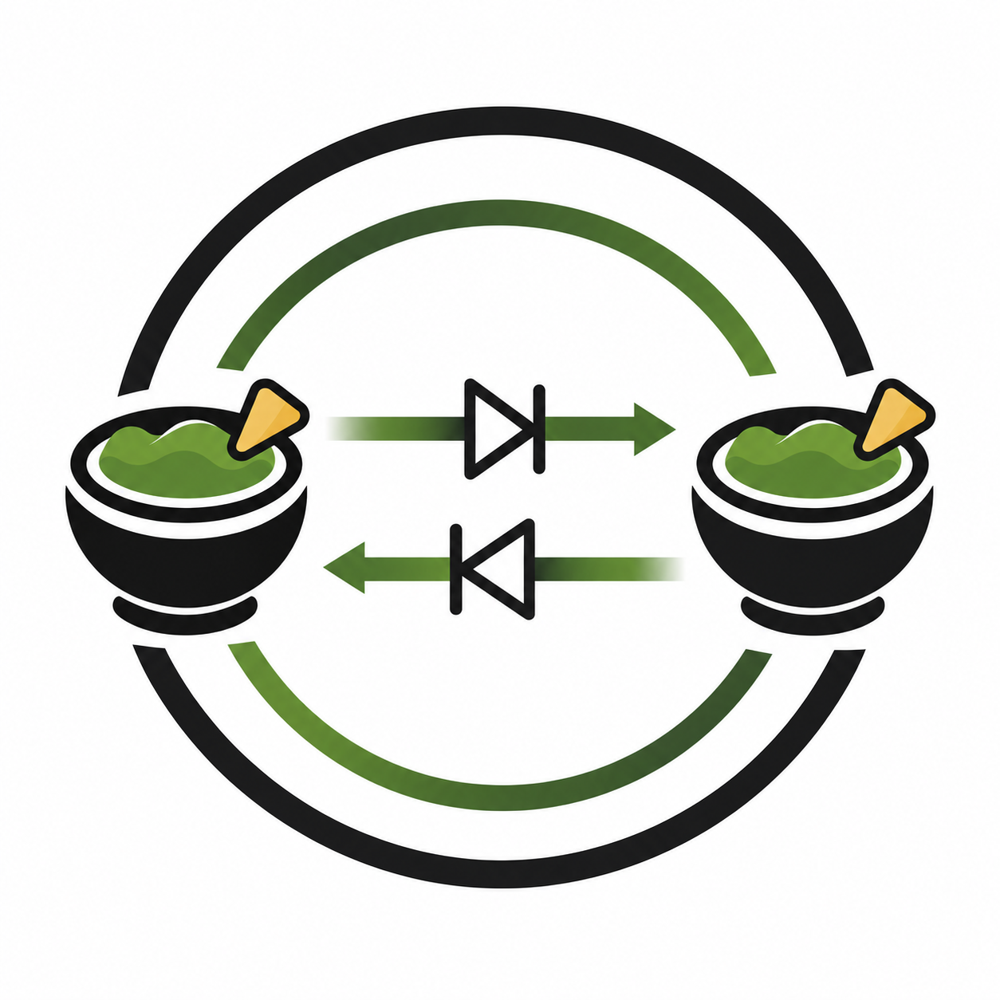
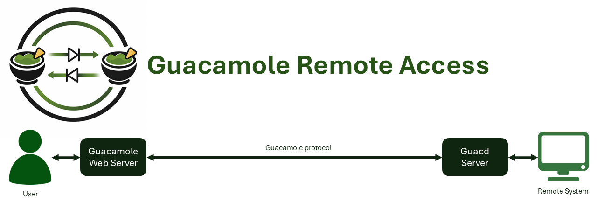

# <table><tr><td></td><td>Guacamole Remote Access over Data-Diodes</td></tr></table>

Data-diodes are commonly used for one-way communication only. However, in many cases, bi-directional information flow is also required. Think about file transfer or remote access. In this case, we focused on the remote access use case, which is one of the more complex applications to implement over a data-diode architecture.

Since 2020, I have researched data-diodes and especially data-diode architectures to create more security for applications that require bi-directional data exchange. I have already implemented several different applications and experimented with different setups. From 2022, I started a project to research how to improve interfaces with critical OT systems, such as process automation systems running critical infrastructure. During this project, different solutions have been developed, but still no solution was found for remote access.

We experimented extensively with KVM systems, as KVM systems also create some kind of physical separation between networks. In principle, if only keyboard, mouse, and video are exchanged, the solution is quite safe. However, KVM did not provide the required safety under the "assume breach" approach. Many KVM systems, when breached, still allow an attacker to send large files or connect USB devices.

Then the idea arose to use a data-diode architecture to implement remote access using the open-source Guacamole remote access application from the Apache Foundation. This project has created a Guacamole streaming protocol that is very suitable for such an application. By filtering the protocol, it is possible to make sure that only video, mouse, and keystrokes are exchanged.

Eventually, I came up with a three data-diode solution to make sure that, under the "assume breach" approach, the solution could still only transfer video, mouse, and keystrokes. This three data-diode solution is still being researched, and more applications are being developed. This repository shows the implementation of the Guacamole protocol, making it possible to implement remote access over a data-diode architecture that physically segregates both networks, providing a significant improvement in security.

During the research, two companies were found that implement remote access over data-diodes, like DataFlowX Secure Remote Access (see [link](https://www.dataflowx.com/en/secure-remote-access)) and Waterfall Hardware Enforced Remote Access (HERA) (see [link](https://waterfall-security.com/ot-insights-center/ot-cybersecurity-insights-center/hardware-enforced-remote-access-hera-under-the-hood/)), which was introduced in July 2024. Both solutions use data-diodes to provide physical network segmentation and only implement application-specific data exchange for remote access.

These applications showed that using data-diodes for remote access could be a very good option. Furthermore, it is always good to have good options within the open-source space and actively contribute to the open-source community, especially in security!

This project is about the implementation of a hardware-based security solution, using a data-diode architecture, for the Guacamole remote access open-source application provided by the Apache Foundation. This provides a very nice option when you would like to secure remote access.

The remote access Apache Guacamole project can be found at https://guacamole.apache.org/.

> **Disclaimer:** This software is provided "as is" and is used entirely at your own risk. Only use this software if you understand what it does, how it works, and the potential impact of deploying it in your environment. The developer assumes no responsibility or liability for any damage, data loss, security issues, or other consequences resulting from the use, misuse, or incorrect configuration of this software.

## Risks are increasing for critical infrastructure

While cyber criminals and nation-state cyber hackers are increasingly able to use zero-days in their attacks, the need for hardware-based security has grown. Especially for critical and vital computing systems, organizations should not rely solely on software-based security systems.

In the last year (2024), major firewall suppliers have all had severe vulnerabilities in their products. Danish critical infrastructure has been attacked using zero-days in Zyxel equipment. With the rise of AI and automated AI attacks, this risk is increasing even further, making complex attacks much more accessible to cyber criminals.

In my research into hardware-based solutions for different types of interfaces, it shows that many vendors are still moving towards software-based solutions. Especially remote access is an interface that is not easily secured.

Even with the best security measures, it is still possible that someone with malicious intent can convince a person within the company to log in. Therefore, the hardware-based solution should only protect the interface in such a way that an attacker is unable to move laterally into the critical network or attack the critical network through network-based hardware.

The hardware-based solution should implement its functionality in hardware, ensuring that an attacker cannot bypass it through a new firmware update or a discovered software vulnerability.

# Design

I assume you already have knowledge of the Guacamole Remote Access project. In this case, the Guacamole Server and guacd communicate with each other using the Guacamole protocol. This protocol is independent of the remote access implementation, such as VNC, SSH, RDP, etc. This makes it perfectly suitable to be used within a data-diode architecture.

This picture briefly shows how the Guacamole remote access application is implemented. It consists of two applications. The Guacamole Server, where the user logs in, allows the user to select the configured remote access systems. When selected, the Server communicates with guacd (Guacamole daemon) using the Guacamole protocol.

Based on this communication, guacd performs the actual remote access to the remote system using the requested protocol. The protocol can be SSH, VNC, or RDP, for example.

When implementing a solution using data-diodes, the location of the data-diodes is between the Guacamole Server and guacd. In this case, only the Guacamole protocol is required to be implemented. When the Guacamole project implements other protocols, this should not have any effect on the data-diode proxies.

First, the two-node data-diode architecture is discussed. This is a direct approach and places the data-diodes anti-parallel. In this case, the gmlbroker accepts connections from the Guacamole Server and only sends key and mouse movements to the other side over the data-diode.

When the gmlbroker is compromised, it is possible that an attacker would try to send more than only keystrokes or mouse movements. This will be filtered by the gmguard, which rejects everything that is not allowed. Only key strokes and mouse movements are forwarded.

The gmguard sends all allowed information to the gcdbroker. The gcdbroker communicates with guacd and simulates that it is the Guacamole Server. All information that is received is sent to the gmlbroker.

Note that this configuration still physically separates the low-side and high-side networks. Therefore, lateral movement over the network is not possible. Of course, there is still a remote access point that attackers could use. Therefore, monitoring and approval processes should still be implemented.

Under the assumption that the high-side network is also compromised, it is possible to place the gmguard between the data-diodes. In this way, the gmguard is fully physically separated from both networks.

When both networks are compromised, it is still very complex to compromise the gmguard. It is still able to filter the traffic appropriately. Therefore, this gmguard can be considered independent.

The two figures below show more detail of the 3-node design and the real setup. All ports that are used are the same with the 2-node setup, so you should be fine.

An approval process could also be implemented by this gmguard. There is a simple example prepared so you can see how it could work. The idea is that an operator on the trusted OT side can decide if connections are allowed or not. The guard already has a global approve/deny state and an operator can change it, so connections are really let through or blocked. But this is only an example and you should not trust it: it is one global state for everything and it can be changed from outside with a simple UDP message, so there is no real protection around it. In the future I would like a different, trustworthy implementation where you can approve or deny individual connections instead of one global switch. Have a look at the [proxies README](proxies/README.md) and the `approval.py` example there for the details.

# Docker

This project provides different proxies that are required to implement the Remote Access Guacamole solution over a two-node or three-node data-diode architecture. These applications are also provided as Docker images on Docker Hub, so they can be directly used.

The following Docker images are created by this project:

- gmlbroker: https://hub.docker.com/r/macsnoeren/gmdatadiode-gmlbroker
- gmguard: https://hub.docker.com/r/macsnoeren/gmdatadiode-gmguard
- gcdbroker: https://hub.docker.com/r/macsnoeren/gmdatadiode-gcdbroker
- nettest: https://hub.docker.com/r/macsnoeren/gmdatadiode-nettest

Next to these there is also a `test-guacamole` image in this repository. This is not a proxy, it is the normal Apache Guacamole webapp image with one small extra startup step, so it can trust the self-signed certificate that the gmlbroker makes when TLS is on. It is only used to test the solution and it is not published on Docker Hub. See `dockers/test-guacamole` for the details.

## TLS between the Guacamole server and the gmlbroker

The link between the Guacamole server and the gmlbroker can be encrypted with TLS. This is optional and off by default. When you turn it on, you do not have to generate any certificates by hand. The first time the gmlbroker starts with TLS on, it makes its own self-signed certificate. The Guacamole side then has to trust that certificate, so it can talk TLS to the gmlbroker.

For the local test this is all done for you by the `test-guacamole` image. When you run your own Guacamole on an other machine, you import the certificate in the Java truststore yourself. The full steps (how to turn it on, and how to make Guacamole trust the certificate) are in the [docker-compose README](dockers/docker-compose/README.md).

## Deprecated

When this repository started, a first concept version was available for testing. These old Docker images can be found here:

- gmserver: https://hub.docker.com/r/macsnoeren/gmdatadiode-gmserver
- gmclient: https://hub.docker.com/r/macsnoeren/gmdatadiode-gmclient
- gmproxyin: https://hub.docker.com/r/macsnoeren/gmdatadiode-gmproxyin
- gmproxyout: https://hub.docker.com/r/macsnoeren/gmdatadiode-gmproxyout

# Author and maintainer

This project is created and maintained by Maurice Snoeren. I started the research on data-diodes in 2020 and I keep working on it. If you have questions, ideas, or you found a bug, feel free to open an issue or reach out to me.

- Maurice Snoeren (GitHub: [macsnoeren](https://github.com/macsnoeren))

# Students

During the research a lot of work has also been done by students. I really want to thank them for their contribution to the project. Their work helped to improve and test the solution.

- Simon de Cock (GitHub: [sdcock](https://github.com/sdcock))
