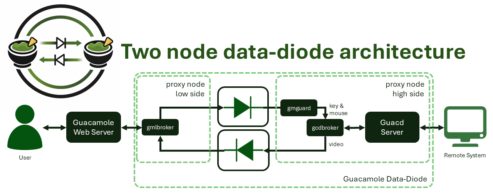
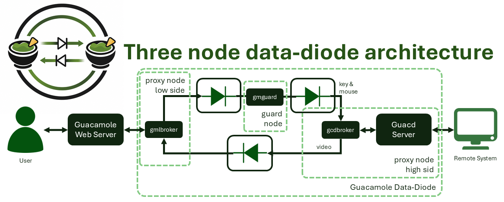

# Remote Access over a Data-Diode Architecture using the Apache Guacamole Protocol

**Author:** Maurice Snoeren
**With contributions from students:** Simon de Cock, and others
**Version:** working paper, 2026

> **Disclaimer:** This is a research paper about a proof-of-concept implementation. The software is provided "as is" and is used at your own risk. It should not be used in a real critical environment before it is fully understood what it does and where the limits are. Some parts described here (the approval process especially) are examples only and should not be trusted as-is.

## Abstract

Remote access is one of the interfaces that is really hard to secure for critical infrastructure and operational technology (OT) systems. Firewalls and other software-based solutions keep getting breached, also by zero-days, and once an attacker is in there is often not much stopping lateral movement into the critical network. Data-diodes solve a big part of this problem because they only allow information to flow in one direction and this is enforced in hardware, not in software. The downside is that a lot of useful applications, like remote access, need information to flow in both directions.

This paper describes a solution that implements remote access over a data-diode architecture using the open-source Apache Guacamole remote access application. The key idea is that the Guacamole protocol, which is spoken between the Guacamole server and the guacd daemon, is protocol-agnostic (it does not care if the underlying protocol is RDP, VNC or SSH) and it can be split and filtered. By placing data-diodes between the server and guacd, and by filtering the Guacamole protocol so that only keystrokes, mouse movements and screen updates cross, remote access becomes possible while the two networks stay physically separated. A two-node and a three-node architecture are presented, the implementation of the proxies (the brokers and the guard) is described including how the protocol is filtered and how the handshake is faked so the browser stays responsive, and the testing that was done (stress testing and static code analysis) and the limitations are discussed. The three-node architecture, where the guard sits between two diodes and is physically separated from both networks, is the more secure option and is still being researched. The solution is compared with two commercial products, DataFlowX Secure Remote Access and Waterfall HERA, and the paper ends with the current limitations and the future work.

## 1. Introduction

Research on data-diodes, and more specific on data-diode *architectures*, has been going on since 2020, with the goal to bring more security to applications that normally need two-way communication. A data-diode on its own is simple: it is a device that only lets data go one way and this is done in hardware, so it can not be reprogrammed or updated in the firmware to make it two-way [1]. That is exactly what makes it strong. But it is also the reason why many applications can not use it directly, because most useful things (file transfer, remote access, database sync) need at least some information back.

From 2022 a project was started to look at how to improve the interfaces towards critical OT systems, like the process automation systems that run critical infrastructure. During that project a lot of solutions were developed, but for remote access there was still no good answer. Remote access is special because it is used the most (vendors need it, operators need it) and at the same time it is one of the hardest to secure. Even with the best security in place, someone with bad intentions can still convince an employee to log in for them. So the goal became: build a solution where, even under an "assume breach" way of thinking, an attacker on the remote-access interface can still not move into the critical network and can still not do more than keyboard, mouse and video.

During the research, KVM systems were tried first, because a KVM also gives some kind of physical separation between networks. In principle, if only keyboard, mouse and video are exchanged, this is quite safe. But KVM did not hold up under the "assume breach" approach. A lot of KVM systems, once they are breached, still let an attacker send large files or attach USB devices. So the separation was not real enough.

Then the idea came to use a data-diode architecture together with the open-source Apache Guacamole remote access application [2]. Guacamole is a clientless remote desktop gateway: the user works in a normal web browser, and behind the scenes the Guacamole server talks to a daemon called guacd using a protocol that is called the Guacamole protocol. This protocol is what makes it interesting, because it is independent of the actual remote access protocol (RDP, VNC, SSH). If the connection between the server and guacd is cut and data-diodes are put there, only this one protocol has to be dealt with, and it can be filtered so only video, mouse and keystrokes go through.

This paper describes that implementation. The repository provides the proxies (C++ programs) that move and filter the Guacamole traffic over the diodes, packaged as Docker images so they can be used directly. The contribution is not a new theoretical result but a working, open-source implementation of remote access over a data-diode architecture, which is something that up to now only exists in a few commercial products.

## 2. Background and related work

### 2.1 Data-diodes and unidirectional gateways

A data-diode (also called a unidirectional gateway) is a device that physically allows data to travel in only one direction. NIST describes it as a device that enforces one-way flow at the physical layer, and because this is a hardware property it can not be bypassed by a firmware update or a software vulnerability [1]. This is the big difference with a firewall: a firewall is software and can be misconfigured, has bugs, and can be attacked; a diode simply has no return path in the hardware.

Data-diodes are already used a lot in OT and critical infrastructure, for example to send monitoring data or historian data from the OT side to the IT side without giving any way back in [1][3]. NIST SP 800-82 (Guide to Operational Technology Security) and the IEC 62443 standards both describe unidirectional gateways as part of a layered defence for high-risk environments, especially at the boundary between zones of different trust levels [3]. The classic problem stays the same though: a plain diode is great for one-way telemetry, but as soon as an application needs something back, a single diode is not enough.

### 2.2 The Apache Guacamole protocol

Apache Guacamole is an open-source, clientless remote desktop gateway from the Apache Software Foundation [2]. The user only needs a browser. The important part for this research is the internal architecture. The Guacamole web application (Java, runs in a servlet container like Tomcat) does not itself understand RDP or VNC. It speaks the *Guacamole protocol* to guacd, the native proxy daemon. guacd is the one that loads the client plugin for the requested protocol and does the actual remote access [2].

Because of this split, the Guacamole protocol is protocol-agnostic: it is basically a protocol for remote display rendering and input events. Neither the web application nor the browser has to know which real protocol is used underneath [2]. This is exactly the property that makes it suitable for a diode architecture. When the diodes are placed between the Guacamole server and guacd, only the Guacamole protocol has to be implemented and filtered, and when the Guacamole project adds a new underlying protocol later, the diode proxies do not have to change.

The Guacamole protocol itself is a stream of instructions. Each instruction is a list of elements, and each element is written as `LENGTH.VALUE`, separated by commas and closed with a semicolon, for example `5.mouse,3.100,3.200,1.0;`. This simple, self-describing structure is nice for filtering, because it can be parsed with a small finite state machine and it is possible to decide per instruction (per opcode) if it is allowed or not.

### 2.3 Why this is needed now

The need for hardware-based security is growing. In the last years the major firewall vendors all had severe vulnerabilities in their products. A clear example is the attack on Danish critical infrastructure in May 2023, reported by SektorCERT: attackers exploited a zero-day (CVE-2023-28771, CVSS 9.8) and later two more zero-days in Zyxel firewalls, and compromised the networks of 22 companies in the energy sector, some of them within a day [4][5]. This was the largest cyber incident in Denmark up to that moment. With the rise of AI and automated attacks, this kind of complex attack becomes more accessible to more attackers, so relying only on software-based security for the most critical systems is not a good idea any more.

### 2.4 Related commercial work

During the research two companies were found that implement remote access over data-diodes, which shows that the idea works and is wanted in the market.

- **DataFlowX Secure Remote Access** uses data-diodes to give physical network segmentation for remote access [6].
- **Waterfall HERA** (Hardware Enforced Remote Access), introduced in July 2024, uses Waterfall's unidirectional (data-diode) technology to give an authenticated user keyboard and mouse control on a virtual machine on the OT side, with the screen sent back over a separate unidirectional connection [7][8]. So it uses two physically separate one-way channels, an inbound and an outbound one, which is close to the anti-parallel diode idea described in this paper. HERA also adds hardware-based key storage (TPM) and message encryption.

Both products are closed and commercial. It is always good to also have an open-source option, especially in security, so that people can inspect it, learn from it and contribute. That is one of the motivations of this project.

## 3. Threat model and design goals

The design is done under an "assume breach" approach. The main assumptions and goals are:

1. **Assume the IT (low) side is compromised.** An attacker may have full control of the Guacamole server and of the low-side broker. Even then, the attacker must not be able to send anything other than keystrokes and mouse movements towards the OT side, and must not be able to reach the OT network on the network level (no lateral movement).
2. **Physical separation must be real.** The low-side and high-side networks are separated by hardware diodes. There is no network route between them. Even if both sides run arbitrary code, the hardware still only lets data flow one way per diode.
3. **The filtering must not be bypassable by software.** In the strongest setup the filtering component (the guard) should not be reachable or reprogrammable from either network.
4. **Only video, mouse and keystrokes.** Under breach, the solution should still only be able to transfer video, mouse and keystrokes. Things like file upload, clipboard abuse or arbitrary tunnelling must be filtered out.

There is one honest point that must be made: this is a remote access solution, so there is still a remote access point that an attacker could try to use. The diode architecture makes sure the attacker can not move laterally into the network and can not send more than input and video, but it does not remove the need for monitoring and for an approval process. Someone can always try to trick a legitimate operator into logging in. So the hardware solution protects the *interface*; it does not replace the human and organisational controls around it.

## 4. Architecture

The place where the diodes go is always the same: between the Guacamole server and guacd (see Figure `gm-remote-access.png`). Only the Guacamole protocol has to be carried across. Two architectures are described: a two-node and a three-node one.

### 4.1 Two-node architecture



The two-node architecture (Figure `gm-two-nodes.png`) is the direct approach. Two diodes are placed anti-parallel between a low node and a high node.

- The **gmlbroker** (low-side broker) runs on the low node. The Guacamole server connects to it as if it were guacd. It accepts the connection and only sends the allowed traffic (keystrokes, mouse) over the forward diode.
- The **gmguard** (guard) filters the traffic and rejects everything that is not allowed. In the two-node setup the guard runs on the high side.
- The **gcdbroker** (high-side broker) connects to the real guacd and pretends to be the Guacamole server. Everything it gets back from guacd (the screen updates) is sent back over the return diode to the gmlbroker.

The traffic flow is:

```
Guacamole Server <-> gmlbroker  --(DD)-->  gmguard  --(DD)-->  gcdbroker <-> guacd
```

and the video and screen updates flow back the other way over the return diode.

The idea is: even when the gmlbroker is compromised and an attacker tries to send more than only keystrokes or mouse movements, the gmguard filters this and only forwards what is allowed. The two networks stay physically separated, so lateral movement over the network is not possible.

### 4.2 Three-node architecture



The two-node design has one weak point: the guard runs on the high side. When it is also assumed that the high-side network is compromised (which under a strict "assume breach" should be done), then the guard is running inside a compromised network. The three-node architecture (Figure `gm-three-nodes.png`) solves this by giving the guard its own machine in the middle, between the two diodes.

Now the guard is physically separated from *both* networks. It receives over one diode and sends over the other diode, and it has no network path to either the low or the high side. Even when both networks are compromised, it is still very complex to compromise the guard, because there is simply no way in over the network. So the guard can be considered independent, and it keeps filtering the traffic correctly no matter what happens on the two sides. This is why the three-node architecture is considered the more secure one, and it is the setup that is still being researched further. Figure `3-node-architecture.webp` shows the detailed setup and Figure `3-node-photo.png` a real build of it. The ports used are the same as in the two-node setup.

### 4.3 Transport over the diode

An important consequence of using real diodes is that TCP does not work across them. TCP needs a handshake and acknowledgements, which need a return path, and a diode has no return path. So the transport across the diodes is done with **UDP**, which is fire-and-forget. This has a few practical results:

- Because there is no ARP reply coming back over a diode, the machines can not learn the MAC address of the other side automatically. The ARP/neighbor table has to be filled statically on each sending machine, otherwise the UDP packets never leave.
- There is no built-in reliability. The design has to cope with the fact that a datagram can be lost, and the higher-level Guacamole logic and the brokers deal with keepalives and re-synchronisation.

Multiple Guacamole connections (different browser tabs, different sessions) are multiplexed over a single UDP stream. Every message that goes over the diode is wrapped in a small header, called a `BridgeMessage`. The wire format is a 3-byte header followed by the payload:

```
 byte 0   byte 1   byte 2            byte 3 .. N
+--------+--------+--------+---------------------------+
|   channel (BE)  | flags  |   payload (0..1200 bytes) |
+--------+--------+--------+---------------------------+
                    |
                    +-- bits 7-6 = action, bits 5-0 = reserved (must be 0)
```

The 16-bit channel id (big-endian) is what separates the different Guacamole connections. The top two bits of the flags byte carry an *action*: `NONE` (normal payload), `CREATE_CHANNEL` (a new connection is being set up), `SHUTDOWN_CHANNEL` (forget this channel) and `APPROVAL` (a verdict for a channel, used by the approval process). The maximum payload per datagram is 1200 bytes, which keeps a full datagram comfortably inside a normal Ethernet MTU so it does not get fragmented on the way over the diode. Bigger reads are chunked into multiple messages before they are sent.

## 5. Implementation

The proxies are written in C++ (C++17) and share a small library with the networking and Guacamole parsing code. Each program is a separate Meson project. They are packaged as Docker images (`gmlbroker`, `gmguard`, `gcdbroker`, and a `nettest` stress-test tool) so they can be run directly with Docker Compose in a 1-node (test), 2-node or 3-node setup.

### 5.1 The guard: filtering the Guacamole protocol

The guard is the heart of the security. It receives the multiplexed UDP traffic, keeps a separate parser (a finite state machine) per channel, and only forwards what is allowed. The core of the policy is an allowlist of Guacamole opcodes. Only these opcodes may cross towards guacd:

```
key   ack   end
size  name  argv  blob
audio video image mouse
select connect timezone clipboard disconnect
```

Everything else is rejected. What happens on a rejected opcode depends on the situation. When the guard sees an opcode that is not on the list, it *excises* it: it cuts that instruction out of the buffer and forwards the rest, so the allowed traffic keeps flowing (state `DENIED_DATA`). When the stream is no longer valid Guacamole at all (for example someone is sending a reverse shell or random HTTP towards guacd), the parser goes to `STREAM_CORRUPTED`, and then the guard tears the whole channel down: it sends a `SHUTDOWN_CHANNEL` back so the OT side closes guacd, forgets the parser, and "poisons" the channel so everything further on it is dropped until a fresh `CREATE` comes for that channel id.

A couple of things are done on purpose:

- **`sync` and `nop` are NOT allowed** across the guard, even though they are normal Guacamole keepalives. They are swallowed on the forward path and the brokers fake them locally (see 5.2). This keeps the keepalive logic on each side and reduces what has to cross the diode.
- **Clipboard is bounded.** The `clipboard` and `blob` opcodes are allowed, but only for the clipboard stream, and the guard tracks the clipboard stream index. A `blob` on any other stream (for example a file upload trying to use the same mechanism) is denied, and the clipboard payload itself is capped at a maximum number of bytes. This is to stop the clipboard being abused to smuggle big files or data across.
- **Untrusted input is validated before it is trusted.** The guard receives things over UDP and can not trust the sender. For example, the connection identifier (the "request id") in a `CREATE` message is validated to be exactly a fixed number of lowercase hex characters before it is logged, echoed or acted on. Otherwise an attacker could pack terminal escape sequences or fake log lines into it, which the guard prints. A malformed id is simply dropped, like a malformed datagram, so a forged `CREATE` can not reset a live channel.

Because the whole filtering is a small, self-contained finite state machine over a simple text protocol, it is possible to reason about it and to test it, which is important for something that is supposed to be a security gate.

### 5.2 The brokers: handshake forging and keepalives

A naive implementation would just tunnel the raw handshake back and forth. The problem is latency: the Guacamole handshake is a back-and-forth (select the protocol, get the list of connection parameters, send connect, get ready), and every round trip has to cross two diodes and the guard. Over real diodes this becomes slow and the browser feels unresponsive.

To fix this, the low-side broker (gmlbroker) *forges* the handshake locally. When the browser selects a protocol (for example `ssh` or `rdp`), the gmlbroker immediately answers with a canned `args` list. These lists are captured verbatim from a real guacd (pinned to guacd 1.6.0), because the browser builds its `connect` instruction positionally against this list, and the real guacd later validates that the count and order match. When the browser sends `connect`, the gmlbroker answers with a `ready` instruction using a fake, v4-style connection id (like guacd would make), and it paints a simple "waiting" screen (a solid dark rectangle) so the user sees something immediately. Meanwhile the real handshake is kept verbatim and replayed to the real guacd on the high side once the connection is approved. So the browser gets a fast, local handshake, and the real guacd still gets a correct handshake it accepts.

This forging is deliberately *not* a security feature (the handshake forger accepts every handshake opcode; the security is the guard). It is a responsiveness feature. But it is a good example of why the protocol can not just be naively bridged over diodes; it has to be understood and parts of it reproduced on each side.

### 5.3 Approval process (example only)

The idea of the approval process is that an operator on the trusted OT side decides whether connections are allowed. This is a real security idea: even if someone gets access on the IT side, nothing goes through the guard until a person on the trusted side says yes. In the three-node design this fits naturally on the guard, which sits in the middle and is separated from both networks.

The guard has a simple version of this. It keeps a global approve/deny switch. On a `CREATE` (which is an inert request, never Guacamole), the guard asks its approver for a verdict and emits an `APPROVAL` message with an `A` or `D` char plus the request id. No Guacamole crosses for a channel until it is approved. A "deny" does not only block new requests, it also tears down the sessions that are already running. An operator changes the switch by sending a plaintext `approve` or `deny` UDP datagram to the guard's control port; a small self-contained Python web console (`approval.py`, standard library only, two buttons) is provided as the operator side.

**But this is only an example and it should not be trusted as-is.** It is one global switch for everything, not per connection, and anyone who can send a UDP datagram to the control port can flip it, there is no protection around it. The console also has no authentication (it is meant to run on a trusted OT host that only the operator can reach) and it can not read the switch back, it only remembers the last thing it sent. So it does approve and deny for real, but it is coarse and unprotected. A trustworthy, per-connection approval is future work (see Section 8).

### 5.4 TLS on the client link

The link between the Guacamole server and the gmlbroker is a normal TCP connection (this is *before* the diode, on the low side). On a real 2- or 3-node setup this can become a real network hop, for example when the Guacamole server runs on another machine than the gmlbroker. This link can be encrypted with TLS. It is optional and off by default. When it is turned on, the gmlbroker generates its own self-signed certificate on the first start, so no certificates have to be made by hand; the Guacamole side then has to trust that certificate (import it in the Java truststore, or, for the local test, a small helper image does it automatically). This only protects the pre-diode link; the diode itself gives the physical separation.

## 6. Evaluation and testing

This is a proof-of-concept, so the evaluation is mostly functional and about robustness and load, not a formal security proof. Three kinds of testing were done.

### 6.1 Functional testing

The whole chain can be run locally with a 1-node Docker Compose setup, including a real Apache Guacamole webapp, guacd, and test SSH and RDP servers. This makes it possible to actually log in through the browser, open an SSH or RDP session, and see the mouse, keyboard and screen working through the brokers and the guard. The deny path can be tested by setting the guard to deny and seeing the connection blocked.

### 6.2 Stress testing (nettest)

Load-testing Guacamole by hand is painful: it would mean opening many browser tabs and somehow sending input on all of them at the same time and measuring the latency. For this a separate Python stress-testing suite, `nettest`, was built. It uses asyncio coroutines to create a lot of Guacamole connections at once, send input (a "probe") on all of them, and measure the round-trip times (mean, min, max, standard deviation) and the timeouts. The main use case is to find out how many connections Guacamole and the bridge can handle before the responses get too slow to be usable. It has a dashboard where the number of connections, the send delay, the duration and the probe type are set (for example a key press that expects a paint response back, which is close to real traffic, or a smaller `argv`/`ack` probe that uses less bandwidth).

`nettest` also has a "bad connections" option that sends non-Guacamole traffic (like a reverse shell or a random HTTP call) towards guacd. The guard should catch this and shut those connections down, while the good connections stay healthy. So this also partly tests the filtering of the guard under load, not only the latency.

### 6.3 Static code analysis (CodeQL)

Because the proxies are written in C++ and are the security-critical part, the C++ code is scanned with CodeQL [9]. Two helper scripts do a clean build (which CodeQL traces by watching the real compiler calls) and then create the database and run the analysis (by default the `cpp-security-and-quality` suite). Next to that, the programs have unit tests (Meson tests), with partial coverage; on the guard the main tested part is the parser logic, which is the most important part to get right.

An honest note has to be made here: the coverage is not complete and there is no formal verification of the filter. For a real deployment more work on assurance would be needed. But the combination of a small, well-defined filter, unit tests on the parser, static analysis, and the stress test with bad traffic gives a reasonable first level of confidence for a proof-of-concept.

## 7. Discussion

A few points came out of this work that are worth writing down.

**The protocol split is the whole trick.** The reason this works at all is that Guacamole already separated the display/input protocol (Guacamole protocol) from the real remote access protocols (RDP/VNC/SSH). This gave a clean, single, text-based protocol to filter, at a place where filtering makes sense (only input and display). If Guacamole had not had this split, the diode approach would have been much harder, because it would mean filtering RDP or VNC directly, which are complex and binary.

**A protocol can not be naively bridged over diodes.** The handshake forging and the keepalive faking show that the protocol has to actually be understood and parts of it reproduced on each side, otherwise the latency over two diodes plus a guard makes the thing unusable. This is a general lesson for "two-way over one-way" designs: it often ends up with terminating the protocol locally on both sides and only sending a filtered essence across.

**The three-node design is where the real strength is.** In the two-node design the guard runs inside the (possibly compromised) high-side network. In the three-node design the guard is on its own machine between the diodes, with no network path to either side. This is the configuration that best matches the "assume breach" goal, and it is close to how the commercial HERA product uses two separate unidirectional channels [7][8].

**It is still a remote access point.** The architecture removes lateral movement and limits what can be sent to input and video, but it does not remove the risk that a legitimate user is tricked into logging in. That is why the approval process and monitoring matter, and why the current global, unprotected approval switch is not good enough for real use.

## 8. Limitations and future work

The current state is a proof-of-concept and there are clear limitations:

- **The approval process is only an example.** It is a single global approve/deny switch, it is not authenticated and it can be flipped by anyone who can reach the UDP control port. The future work here is a *per-connection* approval, where the operator approves each individual request, together with a design that can actually be trusted (proper protection of the control path, so not just an open UDP port). This is the most important next step.
- **Handshake args are pinned to a guacd version.** The canned handshake parameters are captured from guacd 1.6.0. When guacd changes its parameter lists, these have to be updated. A more robust way of learning or negotiating this would be better.
- **Not all protocols are wired up.** SSH and RDP are the ones that were used; the forger falls back to the SSH args for unknown protocols. More protocols should be added and validated against the real guacd.
- **Test coverage and assurance are partial.** Unit tests, CodeQL and stress testing are there, but there is no formal verification of the filter and no complete coverage. For a real deployment the guard would deserve a much higher assurance level, and ideally the filtering would be implemented in a way that is even harder to change (see below).
- **No numbers in this paper yet.** The `nettest` tool measures latency and maximum connections, but this paper does not yet report concrete measurement results for a specific hardware setup. Publishing a proper measurement campaign (how many concurrent sessions stay usable, latency under real diodes) is planned.
- **Reliability over lossy diodes.** The transport is UDP with no built-in reliability. The behaviour under packet loss on real diodes needs more study, and maybe a small forward-error-correction or re-sync mechanism.

Beyond fixing these, there are two bigger directions to follow. The first is moving the filtering closer to hardware, for example an FPGA-based guard, so that the filter itself can not be changed by a firmware update or a software bug (earlier in this research FPGA-based diode designs were already experimented with). The second is applying the same "filter a protocol-agnostic essence over a diode architecture" idea to other interfaces than remote access, since the pattern seems general.

## 9. Conclusion

Remote access is one of the hardest interfaces to secure for critical infrastructure, and software-only security keeps failing, as the 2023 attack on Danish energy infrastructure through firewall zero-days showed [4][5]. Data-diodes give hardware-enforced one-way separation, but they can not be used directly for two-way applications like remote access.

This paper described an open-source implementation that makes remote access possible over a data-diode architecture by using the protocol split inside Apache Guacamole. By placing the diodes between the Guacamole server and guacd, and by filtering the Guacamole protocol on a guard so that only keystrokes, mouse movements and screen updates cross, the two networks stay physically separated while remote access still works. The two-node architecture already gives strong separation; the three-node architecture, where the guard sits on its own machine between two diodes, is physically separated from both networks and is the more secure option, even under the assumption that both networks are breached. The implementation shows that the approach is practical: the guard is a small, testable finite state machine, the brokers forge the handshake so the browser stays responsive, and the whole thing runs as Docker images in 1-, 2- and 3-node setups.

The solution is a proof-of-concept and has real limitations, above all the approval process, which is currently only an unprotected example and needs a trustworthy, per-connection redesign. But it demonstrates that remote access over data-diodes, which so far mostly existed in commercial products like DataFlowX and Waterfall HERA [6][7][8], can also be done in the open-source space, where people can inspect it, learn from it and improve it. That, in the end, is a good thing for security.

## Acknowledgements

This research and implementation was done from 2020 onwards, and a lot of work was done together with students, who deserve a big thank you for their contribution to the project, especially Simon de Cock.

## References

[1] NIST / general references on data diodes and unidirectional gateways, "Data Diode and Unidirectional Gateways", Waterfall Security, and NIST definition of a data diode as a one-way, hardware-enforced device. https://waterfall-security.com/data-diode-and-unidirectional-gateways/

[2] The Apache Software Foundation, "Implementation and architecture", Apache Guacamole Manual v1.6.0. https://guacamole.apache.org/doc/gug/guacamole-architecture.html — see also https://guacamole.apache.org/

[3] NIST SP 800-82 Rev. 3, "Guide to Operational Technology (OT) Security", and IEC 62443, on unidirectional gateways as part of layered defence for OT. Overview: https://gca.isa.org/blog/role-of-data-diodes-in-the-evolving-landscape-of-ot

[4] SektorCERT, report on the November 2023 disclosure of the May 2023 attack on Danish critical infrastructure (CVE-2023-28771 and later Zyxel zero-days). Summary: https://securityaffairs.com/154156/apt/denmark-critical-infrastructure-record-attacks.html

[5] "How Denmark nulled record attacks on critical infrastructure", The Register, 13 November 2023. https://www.theregister.com/2023/11/13/inside_denmarks_hell_week_as/

[6] DataFlowX, "Secure Remote Access". https://www.dataflowx.com/en/secure-remote-access

[7] Waterfall Security Solutions, "Hardware-Enforced Remote Access (HERA) — Under the Hood". https://waterfall-security.com/ot-insights-center/ot-cybersecurity-insights-center/hardware-enforced-remote-access-hera-under-the-hood/

[8] "Waterfall Security launches HERA – hardware-enforced remote access", Data Center Dynamics, July 2024. https://www.datacenterdynamics.com/en/product-news/waterfall-security-launches-hera-hardware-enforced-remote-access/

[9] GitHub, "CodeQL". https://codeql.github.com/

## Appendix A: Guacamole instruction format

Each Guacamole instruction is a list of elements terminated by a semicolon. Each element is written as `LENGTH.VALUE` and elements are separated by commas:

```
5.mouse,3.100,3.200,1.0;      a mouse event at (100,200), button mask 0
3.key,5.65293,1.1;            a key event (keysym 65293 = Enter), pressed
```

The self-describing `LENGTH.VALUE` structure is what lets the guard parse the stream with a small finite state machine and decide, per opcode, whether the instruction is allowed to cross.

## Appendix B: Guard opcode allowlist

Only these opcodes are forwarded towards guacd. `sync` and `nop` are deliberately excluded (the brokers fake the keepalive locally). `clipboard`/`blob` are allowed but bounded (only the clipboard stream, with a byte cap).

| Length | Allowed opcodes |
|-------:|-----------------|
| 3 | `key`, `ack`, `end` |
| 4 | `blob`, `size`, `name`, `argv` |
| 5 | `audio`, `video`, `image`, `mouse` |
| 6 | `select` |
| 7 | `connect` |
| 8 | `timezone` |
| 9 | `clipboard` |
| 10 | `disconnect` |
