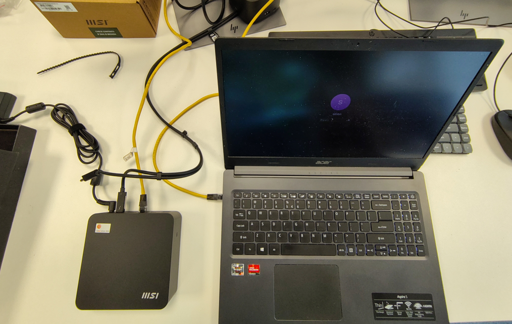

# gmtrafficdumper

A subproject of the Guacamole Data Diode project showcasing Guacamole traffic capture over a direct connection.

Goal: get a better insight in how the Guacamole protocol works under the hood.

Developed by: [Simon de Cock](https://github.com/sdcock) (on behalf of RWE Generation SE)

Description: this code showcases how to set up a containerized installation of Guacamole with Docker Compose that captures all Guacamole traffic between the Guacamole web interface and guacd. The logs generated in the `logs` directory show the opcodes and parameter values from the Guacamole protocol, for example:

```
[2026-03-24T08:41:23.354816] client -> guacd: 6.select,3.rdp;
[2026-03-24T08:41:23.358250] guacd -> client: 4.args,13.VERSION_1_5_0,8.hostname,4.port,...;
[2026-03-24T08:41:23.359031] client -> guacd: 4.size,3.893,3.917,2.96;5.audio,8.audio/L8,9.audio/L16;
```

## The environment

The code was tested on an MSI NUC running a Linux Fedora Workstation OS. It was connected over Ethernet with a laptop also running Fedora Workstation. 



## Prerequisites

*Configure network*: Both devices' IP addresses need to be set manually. In this case, the NUC's IP address was 192.168.50.1 (configured as gateway) and the laptop's IP address was 192.168.50.2. Apply these on the command line, replacing {eth-...} with your Ethernet interface name:

```
# On the NUC
sudo ip addr add 192.168.50.1/24 dev {eth-nuc}

# On the laptop
sudo ip addr add 192.168.50.2/24 dev {eth-laptop}
sudo ip route add default via 192.168.50.1 dev {eth-laptop}
sudo ip link set dev {eth-laptop}
ping 192.168.50.1
```

*Install Docker Compose*: Docker Compose needs to be installed on the NUC:

```
# 1. Add Docker's official repository (for most up-to-date packages):
sudo dnf config-manager addrepo --from-repofile https://download.docker.com/linux/fedora/docker-ce.repo
 
# 2. Install the Docker packages
sudo dnf install docker-ce docker-ce-cli containerd.io docker-buildx-plugin docker-compose-plugin
 
# Optional: always run docker commands as sudo (requires logging out and in again)
sudo usermod -aG docker $USER
 
# 3. Enable Docker
sudo systemctl enable --now docker
 
# 4. Test Docker
docker run hello-world
```

*Enable SSH*: The NUC needs to be accessible via SSH. Go to Settings > System > Secure Shell and enable it. One important detail: Guacamole 1.6.1 will connect over SSH using [an algorithm that is deprecated in OpenSSH](https://marc.info/?l=openbsd-tech&m=163028217802671&w=2), being `ssh-rsa`. The SSH handshake will therefore likely fail. If this happens, add a line to your SSHD config (`~/.ssh/config`), enabling the `ssh-rsa` algorithm:
```
PubkeyAcceptedAlgorithms=+ssh-rsa
```

*Enable Remote Desktop*: The NUC needs to be accessible via RDP. RDP is built into Fedora Workstation. Go to Settings > System > Remote Desktop. Enable both Desktop Sharing and Remote Control. You will need the RDP credentials automatically generated below these settings.

## Install

Clone this repository. You only need the `gmtrafficdumper` directory for this setup.

```
git clone https://github.com/macsnoeren/guacamole-datadiode
```

The Docker Compose file defines four containers:
- `guacamole`, the Guacamole web interface listening on port 8080;
- `guacd`, the software that translates between Guacamole protocol and concrete protocols (SSH, RDP, etc.). This container listens on a Docker bridge on port 4822;
- `guacdb`, the database containing credentials, saved connections and history among other things. It communicates with the `guacamole` container over a bridge as well;
- `guac-proxy`, a custom network proxy written in Python that logs messages into a file. This container routes bridge traffic from port 4823 to 4822.

The communication is therefore:
```
<laptop browser>
|
<Guacamole web server (:8080)>
|
<guac-proxy (:4823/:4822)>
|
<guacd & client plugin (:4822)>
|
<actual remote protocol>
```

## Create connections

Run `docker compose up --build` to automatically pull images and run them and build and run the proxy. Then visit [http://192.168.50.1:8080/guacamole] on the laptop. You should see a login prompt. Fill in 'guacadmin' for both username and password to log in.

Create two connections, one for SSH and one for RDP. Use hostname 192.168.50.1, and port 22 for SSH and 3389 for RDP (make sure you don't use the parameter under 'Guacamole proxy parameters' but under 'Parameters'). For SSH authentication, it uses your Fedora account credentials by default. For RDP, use the credentials specified in Settings > System > Remote Desktop.

Then, connect and try it out.

## Inspect traffic

After the first Guacamole message was sent, the `guac-proxy` automatically generated a timestamped file under `logs/`. It will do this everytime the container is started.
